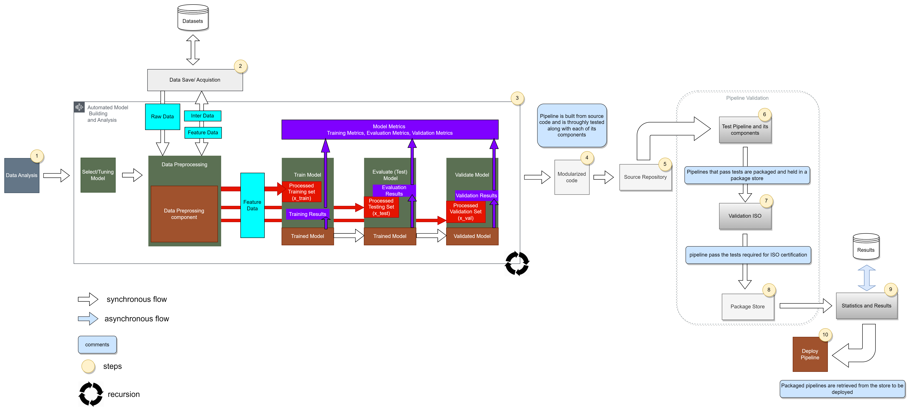

# Arquitetura de Teste e Integração (ATI): Payface

<p align="center">

  <a href="#">
    
  </a>
  <a href="#">
    
  </a> 
</p>

Este projeto tem por objetivo divulgar uma arquitetura que permita a integração e teste automatizado de variados códigos de detecção de vivacidade

Este projeto foi programado utilizando a linguagem de programação Python versão 3.8.5 e utilizando o sistema operacional Windows

## Visão Geral (Em atualização)

A organização desse projeto foi feita através da separação em diversos diretórios, que estão listados a seguir:

* **data** -> Pasta contendo um conjunto de arquivos de dados para treinamento, teste e avaliação do projeto. [[data](./data/)]
* **docs** -> Pasta contendo a documentação do projeto desenvolvido. [[docs](./docs/)]
* **models** -> Pasta contendo as features extraídas do arquivo de instância. [[models](./models/)]
* **src** -> Pasta contendo os principais códigos-fonte do projeto. [[src](./src/)]
* **test** -> Pasta contendo os arquivos de teste unitário de software. [[test](./test/)]

## Fluxograma Geral da ATI

A seguir temos um fluxograma geral da solução para esse desafio.



## Dataset

Para executar o projeto é necessário criar um subdiretório denominado **dataset** dentro da pasta [data](./data/). Neste subdiretório deve ser inserido as pastas com datasets públicos utilizados pelos sistema para treino e teste. 

O dataset público MSU podem ser encontrado no [link](https://drive.google.com/u/0/uc?id=17LPP_ZZprHIG3R2f0Vhg5CyfFZOMvlia&export=download)

:warning: **Nota:** Os datasets possuem um tamanho considerável, assim não foram disponibilizados no github. 

## Organização Geral da Base de Dados

| Dataset    | Instâncias em Condições de Operação Boas                | Instâncias em Condições de Operação Ruins        |
|------------|---------------------------------------------------------|--------------------------------------------------|
| MSU        | 156                                                     | 11                                               |
| UVAD       | Todas - [2, 68, 77, 91, 94, 96, 99, 137, 145, 146, 153] | [2, 68, 77, 91, 94, 96, 99, 137, 145, 146, 153]  |


## Como Executar o projeto principal para a leitura de um modelo específico

Para executar esse projeto execute o comando a seguir:

```
$ python ./main_general.py -m "lbp_model"
```

## Como Executar os Testes Unitários

Foram criados alguns testes unitários. Para executar os testes unitários do projeto execute o seguinte comando:

```
python -m unittest test.test_basic
```

Para executar apenas um teste específico um comando semelhante ao abaixo: 

```
python -m unittest test.test_basic.BasicTests.test_file_analysis_instance1
```

## Arquivos de Entrada com as Features

Na pasta [models](./models/) encontra-se alguns arquivos de entrada com algumas features extraídas da base de dados. 
Esses arquivos estão no formato CSV, em que nas linhas tem-se as instâncias e nas colunas tem-se as features extraídas do modelo. 
A seguir é mostrada uma imagem com a estrutura geral desse arquivo.


Durante a Análise Exploratória dos Dados foram capturadas cerca de 40 features de forma serem utilizadas no treinamento do modelo de aprendizado de máquina.

## Organização do Projeto

```
desafio-senai
├── data
│   ├── database.csv
│   ├── instances
│   │   ├── instance-1.csv
│   │   ├── instance-2.csv
│   │   ├── instance-3.csv
│   │   └── ...
│   └── script-file-split.sh
├── docs
│   ├── analise-exploratoria-dos-dados.ods
│   ├── figures
│   │   ├── formato-arquivo-features.png
│   │   ├── sinal-teoria.png
│   │   └── ...
│   ├── prova_pratica_p2_2021.pdf
│   └── README.md
├── models
│   ├── model-features.csv
│   ├── model-features-simples.csv
│   └── ...
├── src
│   ├── __init__.py
│   ├── code-ai.py
│   └── code-eda.py
├── test
│   ├── __init__.py
│   └── test_basic.py
├── LICENSE
├── README.md
└── requirements.txt
```

## Resultados

Alguns dos principais resultados produzidos podem ser encontradas [aqui](https://github.com/jesimar/desafio-senai/tree/main/docs)

## Limitações do Projeto

* Não foi utilizado Container com Docker.

## Alguns Comandos Úteis

Alguns comandos que podem ser úteis para visualizar e extrair dados do arquivo `database.csv` são head, tail e tr.

```
head -n 2 database.csv > linha2.csv
tail -n 1 database.csv > linha500.csv
tr ',' '\n' < linha1.csv > coluna1.csv
tail -n 800003 coluna1.csv > coluna1n.csv
```
